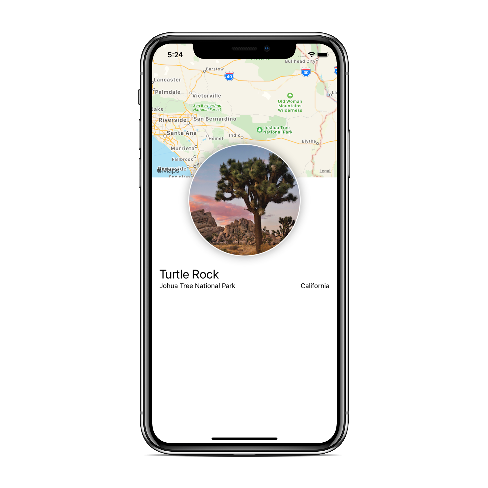
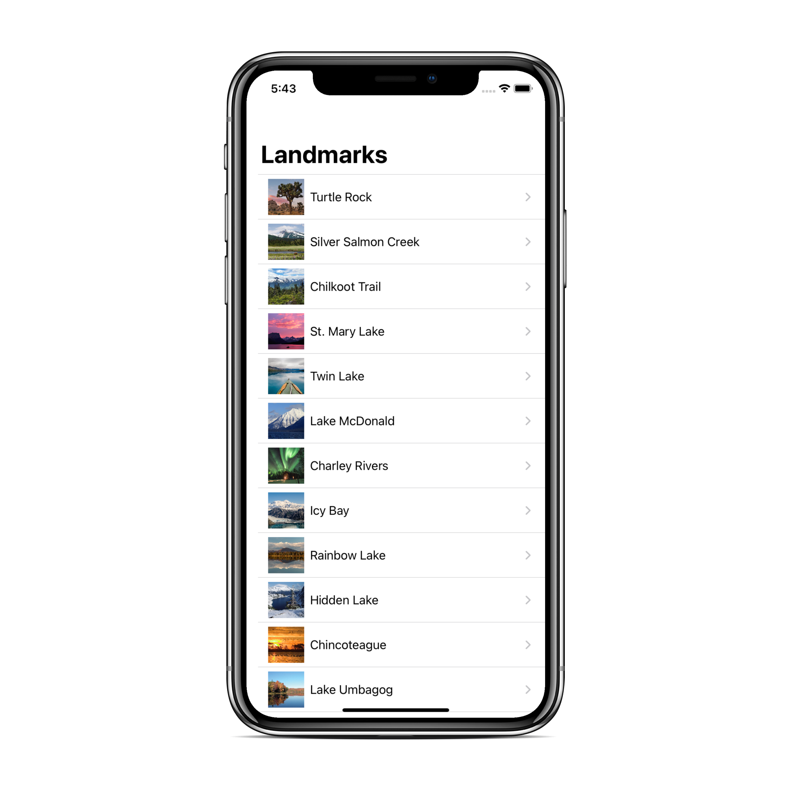
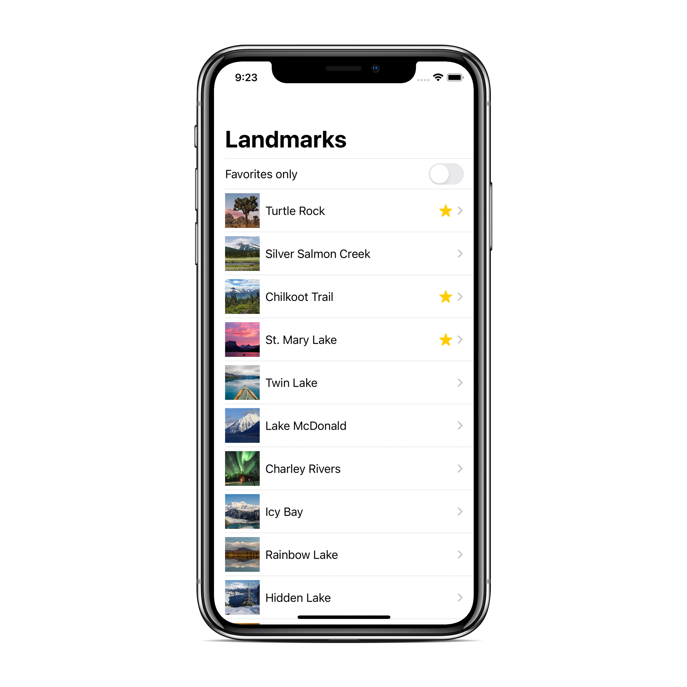
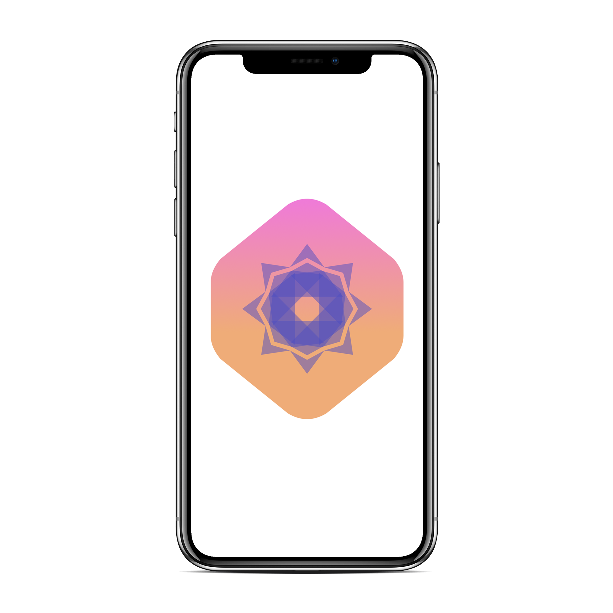

# SwiftUI Tutorials
[](LICENSE)
[](https://github.com/JacobMannix/swiftui-tutorials)
[](https://github.com/JacobMannix/swiftui-tutorials/commits/master)

> <b> Repo to store my progress of Apple SwiftUI Tutorials </b>

#
## SwiftUI Essentials
<!--
### Creating and Combining Views
[][aa1]
[][a1]

### Building Lists and Navigation

[][aa2]
[][a2]

### Handling User Input
[][aa3]
[][a3]

  
-->

| Creating and Combining Views | Building Lists and Navigation | Handling User Input |
| --------------- | --------------- | --------------- |
| [][aa1] | [][aa2] | [][aa3] |
| [][a1] | [][a2] | [][a3] |
|  |  |  |


#
## Drawing and Animation
<!--
### Drawing Paths and Shapes
[][bb1]
[][b1]

### Animating Views and Transitions
[][bb2]
[][b2]
-->

| Drawing Paths and Shapes | Animating Views and Transitions |
| --------------- | --------------- |
| [][bb1] | [][bb2] |
| [][b1] | [][b2] |
<!-- |  |  | -->


#
## App Design and Layout
<!--
### Composing Complex Interfaces
[][cc1]
[][c1]

### Working with UI Controls
[][cc2]
[][c2]
-->

| Composing Complex Interfaces | Working with UI Controls |
| --------------- | --------------- |
| [][cc1] | [][cc2] |
| [][c1] | [][c2] |
<!-- |  |  | -->


#
## Framework Integration
<!--
### Interfacing with UI Kit
[][dd1]
[][d1]

### Creating a Watch OS App
[][dd2]
[][d2]

### Creating a Mac OS App
[][dd3]
[][d3]
-->

| Interfacing with UI Kit | Creating a Watch OS App | Creating a Mac OS App |
| --------------- | --------------- | --------------- |
| [][dd1] | [][dd2] | [][dd3] |
| [][d1] | [][d2] | [][d3] |
|  |  |  |


<!-- Links -->
<!-- Repo Links -->
[a1]:(https://github.com/JacobMannix/swiftui-tutorials/tree/main/A1%20CreatingAndCombiningViews)
[a2]:(https://github.com/JacobMannix/swiftui-tutorials/tree/main/A2%20BuildingListsAndNavigation)
[a3]:(https://github.com/JacobMannix/swiftui-tutorials/tree/main/A3%20HandlingUserInput)
[b1]:(https://github.com/JacobMannix/swiftui-tutorials/tree/main/B1%20DrawingPathsAndShapes)
[b2]:(https://github.com/JacobMannix/swiftui-tutorials/tree/main/B2%20AnimatingViewsAndTransitions)
[c1]:(https://github.com/JacobMannix/swiftui-tutorials/tree/main/C1%20ComposingComplexInterfaces)
[c2]:(https://github.com/JacobMannix/swiftui-tutorials/tree/main/C2%20WorkingWithUIControls)
[d1]:(https://github.com/JacobMannix/swiftui-tutorials/tree/main/D1%20InterfacingWithUIKit)
[d2]:(https://github.com/JacobMannix/swiftui-tutorials/tree/main/D2%20CreatingAwatchOSApp)
[d3]:(https://github.com/JacobMannix/swiftui-tutorials/tree/main/D3%20CreatingAmacOSApp)

<!-- Apple Developer -->
[aa1]:(https://developer.apple.com/tutorials/swiftui/creating-and-combining-views)
[aa2]:(https://developer.apple.com/tutorials/swiftui/building-lists-and-navigation)
[aa3]:(https://developer.apple.com/tutorials/swiftui/handling-user-input)
[bb1]:(https://developer.apple.com/tutorials/swiftui/drawing-paths-and-shapes)
[bb2]:(https://developer.apple.com/tutorials/swiftui/animating-views-and-transitions)
[cc1]:(https://developer.apple.com/tutorials/swiftui/composing-complex-interfaces)
[cc2]:(https://developer.apple.com/tutorials/swiftui/working-with-ui-controls)
[dd1]:(https://developer.apple.com/tutorials/swiftui/interfacing-with-uikit)
[dd2]:(https://developer.apple.com/tutorials/swiftui/creating-a-watchos-app)
[dd3]:(https://developer.apple.com/tutorials/swiftui/creating-a-macos-app)

<!--
#
### HEADING
```python
code

```
-->
